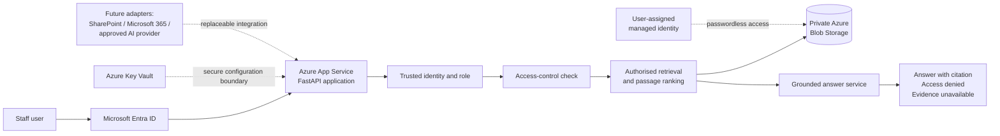
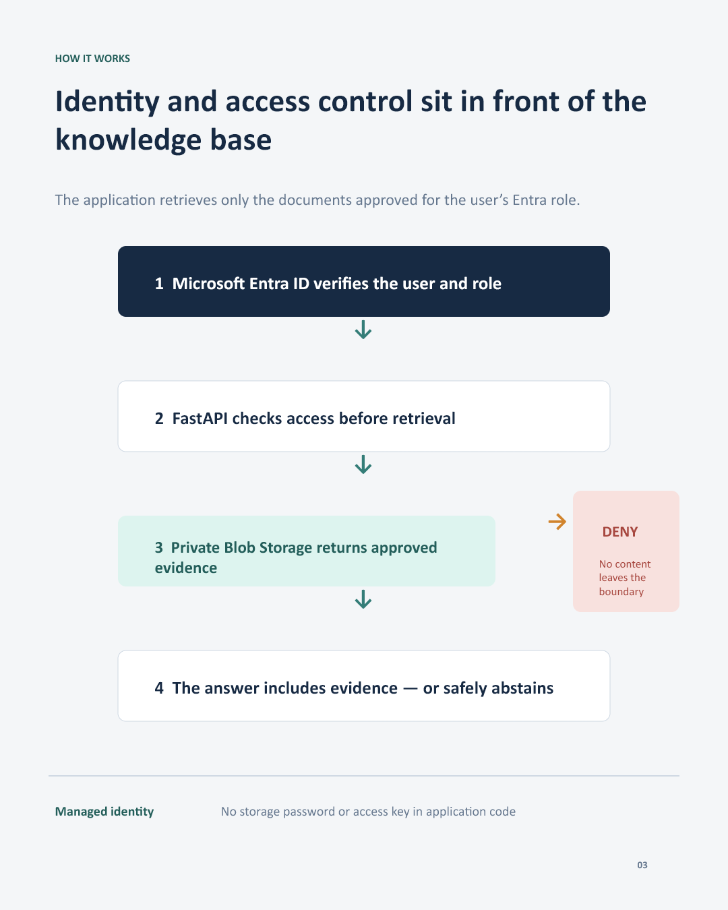

# Governed AI Knowledge Assistant

[](https://github.com/JanithW1996/ai-knowledge-assistant/actions/workflows/ci.yml)

An Azure-hosted portfolio project demonstrating how an organisation can give staff useful answers from approved documents without allowing an AI system to bypass access controls.

The application checks identity and role permissions **before** retrieving information. It then produces one of three controlled outcomes:

- a grounded answer with a source citation;
- an access-denied response with no restricted-content leakage; or
- a safe refusal when authorised evidence is unavailable.

> **Data statement:** every document, role and scenario in this repository is synthetic and fictional. No real employee, customer, payroll, cultural or operational information is used.

## Why I built it

Organisations want the productivity benefits of AI, but their documents do not all have the same sensitivity. A useful knowledge assistant must respect existing permissions, explain where an answer came from and avoid inventing information.

This project demonstrates those controls in a working application that can run locally or as an identity-protected Azure service.

## What the demonstration shows

- **Identity-based access:** the Azure deployment uses Microsoft Entra ID sign-in and assigned application roles.
- **Authorisation before retrieval:** documents outside the trusted role are filtered before their content can be used.
- **Least privilege:** seniority does not automatically override specialist controls; highly confidential payroll guidance remains finance-only.
- **Grounded responses:** supported answers include the source passage used.
- **Safe denial:** unauthorised requests return no restricted citation or content.
- **Safe uncertainty:** the assistant declines when reliable evidence is missing.
- **Passwordless Azure access:** managed identity accesses private Blob Storage without committed keys or passwords.
- **Portable design:** document and answer providers can be replaced without rebuilding the core access rules.

## Architecture



The application has two intentional operating modes:

1. **Local demonstration mode** - a visible persona selector makes access behaviour easy to demonstrate.
2. **Azure Entra mode** - the user cannot select a role; the API accepts the trusted role from the authenticated Microsoft Entra identity.

## Access model

| Document category | Employee | Manager | Senior executive | Specialist access |
|---|---:|---:|---:|---:|
| Public and internal guidance | Yes | Yes | Yes | Yes |
| Management planning | No | Yes | Yes | No |
| Restricted HR procedure | No | No | Yes | HR only |
| Restricted IT procedure | No | No | Yes | IT only |
| Restricted finance summary | No | No | Yes | Finance only |
| Highly confidential payroll review | No | No | No | Finance only |

The seven-document knowledge base is deliberately small and invented so the security decisions remain easy to inspect and test.

## Technology

- **Application:** Python, FastAPI, HTML, CSS and JavaScript
- **Identity:** Microsoft Entra ID and application roles
- **Azure:** App Service, Blob Storage, Key Vault and user-assigned managed identity
- **Infrastructure:** Azure Bicep and Azure CLI
- **Quality:** pytest and GitHub Actions continuous integration
- **Architecture:** ports and adapters with replaceable repositories and answer providers

## Verified quality

The final test suite contains **102 automated tests** covering:

- access-control decisions and hierarchy;
- authorised and unauthorised answer outcomes;
- Entra identity parsing and trusted-role enforcement;
- API contracts and presentation-interface behaviour;
- local and Azure document repositories;
- safe file paths, chunking and retrieval relevance;
- runtime security and production identity requirements.

Run the checks locally:

```powershell
python src/validate_data.py
python -m pytest
```

Expected result:

```text
Dataset validation passed: 7 synthetic documents.
102 tests passed.
```

## Run the local demonstration

1. Create and activate a Python virtual environment.
2. Install the dependencies:

```powershell
python -m pip install -r requirements.txt
```

3. Copy `.env.example` to `.env` and keep the safe local defaults:

```text
APP_ENVIRONMENT=development
IDENTITY_MODE=demo
DOCUMENT_REPOSITORY=local
```

4. Start the application:

```powershell
python -m uvicorn src.api:app --host 127.0.0.1 --port 8000
```

5. Open:

- `http://127.0.0.1:8000` - business-friendly demonstration interface
- `http://127.0.0.1:8000/docs` - interactive API documentation
- `http://127.0.0.1:8000/health` - health endpoint

## Suggested demonstration

1. Ask a general security question as an employee and show the cited answer.
2. Ask an HR question as an employee and show the access-denied response.
3. Repeat as an HR adviser and show the authorised answer.
4. Ask for payroll guidance as a senior executive and show that hierarchy does not override finance-only confidentiality.
5. Repeat as a finance officer and show the grounded payroll answer.
6. Ask an unsupported question and show the evidence-unavailable response.

See [`docs/demo-guide.md`](docs/demo-guide.md) for the complete walkthrough.

## Important boundary

The current answer provider is deterministic and extractive. It does **not** call an external large language model. This keeps the portfolio demonstration predictable, inexpensive and auditable while proving the access, retrieval and deployment architecture.

The provider interface is intentionally replaceable so a future approved enterprise AI service can be introduced behind the existing identity, authorisation and evidence controls.

## Documentation

- [`docs/access-control.md`](docs/access-control.md) - roles, hierarchy and document permissions
- [`docs/final-architecture.md`](docs/final-architecture.md) - completed system design
- [`docs/generation-safety.md`](docs/generation-safety.md) - grounded-answer and prompt-boundary safeguards
- [`docs/azure-governance.md`](docs/azure-governance.md) - naming, tagging and cost controls
- [`docs/azure-secure-services.md`](docs/azure-secure-services.md) - storage, identity and Key Vault design
- [`docs/api-and-azure-adapter.md`](docs/api-and-azure-adapter.md) - API and repository integration
- [`docs/demo-guide.md`](docs/demo-guide.md) - presentation walkthrough


## Portfolio showcase

These materials provide a quick, non-technical overview of the completed project:

- [Architecture overview](docs/portfolio/architecture.md) — explains the identity, access-control, retrieval and answer flow.
- [Architecture diagram](docs/portfolio/architecture.png) — recruiter-friendly visual summary.
- [LinkedIn carousel — PDF](docs/portfolio/linkedin-carousel.pdf) — five-slide project overview.
- [LinkedIn carousel — editable PowerPoint](docs/portfolio/linkedin-carousel.pptx) — editable presentation source.
- [Demonstration recording script](docs/portfolio/demo-recording-script.md) — structured four-minute walkthrough.
- [Public repository security review](docs/portfolio/security-review.md) — completed review and recommended security improvements.
- [Security policy](SECURITY.md) — private vulnerability-reporting guidance.




## Current status and next steps

Completed:

- Entra-protected Azure App Service deployment;
- private Azure document repository and passwordless access;
- role hierarchy and specialist restrictions;
- automated security and behaviour tests;
- recruiter-friendly web interface and documentation.

Future extensions:

- Microsoft SharePoint document adapter;
- Microsoft 365 integration;
- an approved enterprise AI answer provider;
- central monitoring, audit reporting and consumption controls;
- formal security, privacy and responsible-AI review before any real-data use.

## Author

**Janith Weerakkody**

AI and Data Specialist | Darwin, NT

[LinkedIn](https://www.linkedin.com/in/janith-weerakkody-6585ab34a/) | [GitHub](https://github.com/JanithW1996)

Guided access to the identity-protected Azure demonstration is available on request.
