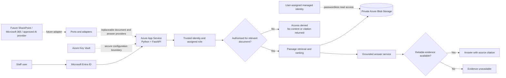

# Governed AI Knowledge Assistant - architecture

## Reading the diagram

1. Microsoft Entra ID establishes the user identity and assigned application role.
2. The API uses that trusted role instead of accepting a user-selected production role.
3. Access control runs before document retrieval.
4. Only authorised passages can reach the answer service.
5. The service returns a cited answer, an access-denied response or an evidence-unavailable response.
6. Managed identity provides passwordless access to the private Azure document container.
7. Provider-neutral interfaces allow future integrations without replacing the core security rules.
